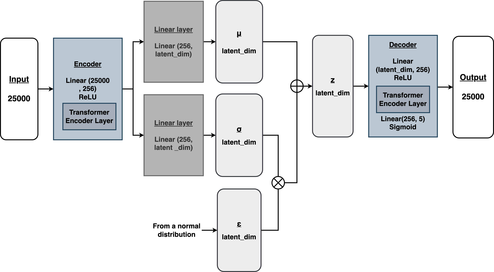

# Image Generator Implemented by VAE with Transformer Encoder
## Problem Formulation
Build a generative model `colored_pi_generator` whose output is a 5-dimensional point which comes from the **same distribution** as the points in the dataset.
### Input
* pi_xs.npy - A numpy array of length 5000 - the x-coordinates of each of the points in the dataset
* pi_ys.npy - A numpy array of length 5000 - the y-coordinates of each of the points in the dataset
* An image

    

### Output
* An image which comes from the same distribution as the points in the dataset
- - -

## Method - VAE (Variational Autoencoder) with Transformer Encoder Layer
### Model Architecture


* VAE provides a probabilistic manner for describing an observation in latent space. Thus, we are going to formulate our encoder to describe a **probability distribution** for each latent attribute.
* **Encoder**
    * Linear Layer -> ReLU Activation Function -> Transformer Encoder Layer
* **Generator**
    * Linear Layer -> ReLU Activation Function -> Transformer Encoder Layer -> Linear Layer -> Sigmoid Activation Function

### Loss Function
* **Reconstruction loss ($Loss_{recons}$)**: how well VAE can reconstruct the input from the latent space
* **Kullback–Leibler Divergence Loss ($Loss_{kld}$)**: how similar the latent distribution and standard normal distribution are
* **Beta ($\beta$)**: A weight to alleviate the KL-vanishing issue is to apply annealing schedules for the KLD loss
* Formula
$$Loss = (1-\beta) * Loss_{recons} + \beta * Loss_{kld}$$
where $\beta$ from 0 linear growth to 1 as the \#epochs increase

* [Reference](https://medium.com/mlearning-ai/a-must-have-training-trick-for-vae-variational-autoencoder-d28ff53b0023)

- - -
## Results
* Training Curves

|Vanilla VAE|VAE with **Transformer**<br /> **Encoder Layer**|
|:----:|:----:| 
|||

* Generative Results
    
|Epochs|1|25|50|75|100|
|:----:|:----:|:----:|:----:|:----:|:----:| 
|Vanilla VAE| |||||
|VAE with **Transformer**<br /> **Encoder Layer**||||||

|Vanilla VAE|VAE with **Transformer**<br /> **Encoder Layer**|
|:----:|:----:| 
|||

- - -

## Usage
* Build environment
    ```
    conda env create -f environment.yaml
    ```
* Put data in `./gen_ml_quiz_content/`
* Run script
    ```python
        python main.py
    ```

- - -

## Dataset
* Please put all the data under `'./gen_ml_quiz_content'` folder. For more details, please reference to [Input](###Input).

## Hyperparameter Setting
* All the experiments are done by the hyperparameters below. Feel free to set your own hyperparameter in `config.yaml`
    | epochs | batch\_size | hidden\_dim | device | num\_workers | result\_path | gen\_every\_epochs | seed | retrain | num_head |
    |:---:|:---:|:---:|:---:|:---:|:---:|:---:|:---:|:---:|:---:|
    | 100 | 1 | 256 | 'cpu' | 4 | './result/' | True | 10 | True | 4 |

- - -

## Reference
* [Cyclical KLAnnealing Schedule](https://github.com/haofuml/cyclical_annealing)
* [PyTorch-VAE](https://github.com/AntixK/PyTorch-VAE)
* [Pytorch-VAE-tutorial](https://github.com/Jackson-Kang/Pytorch-VAE-tutorial)
* [VAE](https://www.jeremyjordan.me/variational-autoencoders/)
